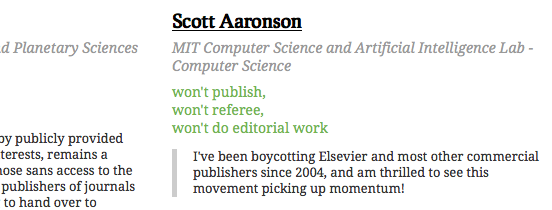
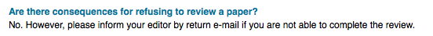

Title: Why you shouldn't refuse to review articles for Elsevier
Date: 2014-08-14 17:19
Slug: refuse-to-review
Author: Tom Pollard
Summary: Why you shouldn't refuse to review articles for Elsevier

<meta name="twitter:card" content="photo" />
<meta name="twitter:site" content="@tompollard" />
<meta name="twitter:title" content="Why you shouldn't refuse to review articles for Elsevier" />
<meta name="twitter:description" content="Won't publish, won't referee, won't do editorial work..." />
<meta name="twitter:image" content="http://tomp.io/images/2014-08-14_boycott_journals.png" />
<meta name="twitter:url" content="http://tomp.io/refuse-to-review" />

A fair number of people refuse to review for certain journals, based on their [pro](http://thecostofknowledge.com/) or [anti](http://www.loria.fr/~zimmerma/open_access.html) open-access stance. 

As [Elsevier tells us](http://www.elsevier.com/reviewers/frequently-asked-questions#are-there-consequences-for-refusing-to-review-a-paper), that's fine. 

Refusal gets the message to the editors, but the authors are the people that prop up the journal (assuming reviewers will always be found somewhere). So it seems better to accept the invitation to review and to include a comment to the authors along the lines of:

> We note that the authors have chosen to submit their article to {JOURNALTITLE}. Have the authors considered alternatives, such as {JOURNALTITLE} and {JOURNALTITLE}? These journals are preferable because ... 

At the very least it'll keep the editors on their toes. If the message reaches the authors, it could be powerful. Targeted, from a place of authority, and hitting a captive audience. You might raise a few hackles, but that's why reviewers get anonymity ;)

