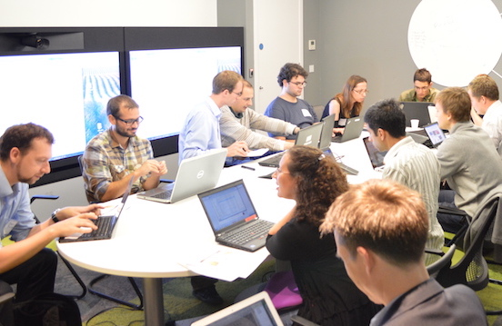

Title: How to access the MIMIC-II critical care database
Date: 2014-09-12 14:45
Slug: accessing-MIMIC-II
Author: Tom Pollard
Summary: This is a quick summary of the current process for accessing the MIMIC-II critical care database.

<meta name="twitter:card" content="photo" />
<meta name="twitter:site" content="@tompollard" />
<meta name="twitter:title" content="How to access the MIMIC-II critical care database" />
<meta name="twitter:description" content="The MIMIC-II Critical Care Datathon" />
<meta name="twitter:image" content="http://tomp.io/images/2014-09-12_datamarathon1.jpg" />
<meta name="twitter:url" content="http://tomp.io/accessing-MIMIC-II" />

Last weekend [we](http://criticaldata.mit.edu/datamarathon/organizers/) hosted a [Critical Data Marathon](http://criticaldata.mit.edu/datamarathon/schedule/#london) in London, alongside parallel events in France (Paris) and the US (Cambridge, MA). The idea was to bring together healthcare providers with data scientists to answer clinically-relevant questions over the course of a weekend. Many thanks to [The Institution of Engineering and Technology](http://mycommunity.theiet.org/communities/home/58), [IDEALondon](http://www.idea-london.co.uk/), [UCL](http://www.ucl.ac.uk/), [KCL](http://www.kcl.ac.uk/index.aspx), [Imperial College](http://www3.imperial.ac.uk/), and [MIT](http://criticaldata.mit.edu/datamarathon/organizers/) for helping to make it happen.

Our focus was the [MIMIC-II database](https://mimic.physionet.org/) [[1]](#Saeed), an incredible resource of critical care data. Aside from some minor hiccups along the way (like getting locked out of the venue on Sunday morning!) I think it's fair to say that the event was a success. We kicked off with some great talks, learnt about MIMIC-II, got to know each other, and even made a start on some clinical questions. 

As anticipated, one of the biggest challenges of the weekend was getting everyone set up with access to MIMIC-II. Not easy with around forty people, each with different skillsets, operating systems, and motivations. Data in MIMIC-II is anonymised but it relates to patients and requires respect, so there are a few hurdles that need to be jumped before access is granted. 

Below I have documented what ended up being the most straightforward route to accessing the MIMIC-II data, in case it is helpful for others. If you're a clinical researcher fed up with battling your own hospital's data management systems, you could do worse than spending a few hours on the following steps:

1. Register with Physionet, the platform that hosts MIMIC-II (and a great source of data in itself). Simply add your details to the [Physionet registration page](https://physionet.org/pnw/login).
2. Complete an approved online ethics training programme in human research, such as the NIH one on [Protecting Human Research Participants](https://phrp.nihtraining.com/users/login.php). This will take a couple of hours.
3. Read the [MIMIC-II access instructions](https://physionet.org/works/MIMICIIClinicalDatabase/access.shtml) and, assuming you agree, click 'I agree' at the bottom of the page. You'll receive an email containing a 'Data Use Agreement'. Complete the agreement and send it to the email address provided, along with a copy of your ethics certificate. 
4. After carrying out some checks, the MIMIC-II team will send you an email to let you know that permission to access the data has been granted.

Once you've gained access there are several different methods for exploring and analysing the data. The most popular options amongst attendees of the London Data Marathon were:

1. [MIMIC Explorer](https://mimic.physionet.org/database/explorer/65-query-builder.html). This is a web-based tool that allows users to view tables and run queries. Exports are limited to 1000 rows, so while it's great for exploring the data, it's not so great for in-depth analysis.

    

2. Local Postgres instance. Setting up a local version of MIMIC-II is the simplest option for people who plan to use the data long-term. Install Postgres, import a dump of the data (you should be able to request this from the MIMIC-II team), and you're ready to go. We found that recreating the database takes around an hour on a solid state harddrive and requires about 60GB of space.
3. [Flat text files](https://physionet.org/works/MIMICIIClinicalDatabase/files/). The entire clinical database is available as a collection of CSV files. Great for experienced programmers like [@MattDowle](https://twitter.com/MattDowle), who demonstrated the power of R at the data marathon!

That's all for now. Hopefully see you at the next MIMIC-II event, which is likely to be in mid-2015.

## References

1. Mohammed Saeed, MD, PhD, Mauricio Villarroel, MBA, Andrew T. Reisner, MD, Gari Clifford, PhD, Li-Wei Lehman, PhD, George Moody, Thomas Heldt, PhD, Tin H. Kyaw, Benjamin Moody, and Roger G. Mark, MD, PhD. [Multiparameter Intelligent Monitoring in Intensive Care II (MIMIC-II): A public-access intensive care unit database](http://www.ncbi.nlm.nih.gov/pmc/articles/PMC3124312/) 2011; 39:952-960. 

