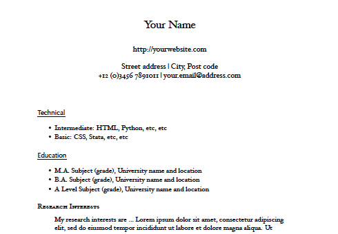

Title: Writing your CV with Markdown and Pandoc
Date: 2014-09-10 16:53
Slug: markdown-cv
Author: Tom Pollard
Summary: Writing your CV/resume with Markdown and Pandoc.

<meta name="twitter:card" content="photo" />
<meta name="twitter:site" content="@tompollard" />
<meta name="twitter:title" content="Writing your CV with Markdown and Pandoc" />
<meta name="twitter:description" content="A cleaner way to create your CV" />
<meta name="twitter:image" content="http://tomp.io/images/2014-09-23_markdown_cv.png" />
<meta name="twitter:url" content="http://tomp.io/markdown-cv" />

A few months ago [Steve Harris](https://twitter.com/drstevok) introduced me to the pleasures of writing in [Markdown](http://en.wikipedia.org/wiki/Markdown). Since then it has been my format of choice for anything text-based. Simple, clear, and non-crashy. So much nicer than working with Word. 

At least one person thinks [Markdown is for hipsters](http://labandfield.wordpress.com/2013/08/08/beware-the-academic-hipster-or-use-what-works-for-you/) but (a) I like hipsters and (b) maybe he's never experienced the horror of opening a Word file saved as HTML. 

Markdown is easily converted to all sorts of document types with [Pandoc](http://johnmacfarlane.net/pandoc/), making it a great native format. You write in Markdown and convert to DOC, PDF, etc when necessary. 

Lots of people write their CVs in Markdown already, but it took me a little time to find a style I liked for the PDF output. I ended up using a template by [Craig Eley](http://craigeley.com/09-05-2013/formatting-your-cv-with-markdown-and-latex/), with a couple of minor changes.

The modified version is online at: 
[https://github.com/tompollard/markdown-cv](https://github.com/tompollard/markdown-cv). To produce a PDF of your CV: 

1. Edit the [source/cv.md](https://github.com/tompollard/markdown-cv/tree/master/source) file.
2. Run 'make pdf' in [the folder](https://github.com/tompollard/markdown-cv) containing the Makefile.
3. Pick up the PDF from [output/cv.pdf](https://github.com/tompollard/markdown-cv/tree/master/output).

[Latex](http://latex-project.org/ftp.html) and [Pandoc](http://johnmacfarlane.net/pandoc/) will need to be installed on your system for this to work. You can modify and improve the style by editing the template at [source/style/template.tex](https://github.com/tompollard/markdown-cv/tree/master/source/style) (Pandoc creates PDFs via Latex).

