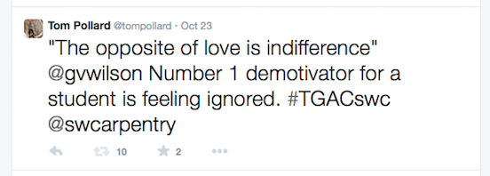

Title: Software Carpentry Instructor Training
Date: 2014-10-27 12:33
Slug: software-carpentry-instructor-training
Author: Tom Pollard
Summary: Software Carpentry Instructor Training

<meta name="twitter:card" content="photo" />
<meta name="twitter:site" content="@tompollard" />
<meta name="twitter:title" content="Software Carpentry Instructor Training" />
<meta name="twitter:description" content="Software Carpentry equips researchers with skills for better programming" />
<meta name="twitter:image" content="http://tomp.io/images/2014-10-27_greg_wilson.jpg" />
<meta name="twitter:url" content="http://tomp.io/software-carpentry-instructor-training" />

Many researchers write and use software, but few receive formal training. Software Carpentry, largely run by volunteers, offers two day workshops around the world to equip researchers with core skills for better programming. 

Three years ago I attended my first [Software Carpentry](http://software-carpentry.org/) workshop at [UCL](http://www.ucl.ac.uk/), where I learnt about scientific Python, test-driven development, and shell scripting. Last week I joined around 40 people at [TGAC](http://www.tgac.ac.uk/) for a Software Carpentry Instructor course, led by [Greg Wilson](https://twitter.com/gvwilson), [Bill Mills](https://twitter.com/billdoesphysics), and [Aleksandra Pawlik](https://twitter.com/aleksandrana). I have cherry picked a few of my favourite bits:

* __"Motivation is the single biggest predictor of outcome"__

    The primary predictor of a student's success is level of motivation. So for a teacher, creating enthusiasm (or not killing it) is as important as giving knowledge. Teaching should be treated as a performance, inspiring confidence and encouraging participation.

    

    After sharing stories of the times that we had been demotivated as students, Greg noted that most of the negative experiences could be grouped into either feeling 1) ignored or 2) unfairly treated. So be inclusive and be fair.

* __Know your students__

    Tailor lessons to the distribution of prior knowledge in the class. Pre-course assessments can help to set the starting point, but care is needed to avoid scaring students away or capturing meaningless information (for example, watch out for the [Dunning-Kruger effect](http://en.wikipedia.org/wiki/Dunning%E2%80%93Kruger_effect)). The Software Carpentry pre-assessment for learners is [here](http://software-carpentry.org/workshops/assess/pre-learner.html).

    '[Formative assessment](http://en.wikipedia.org/wiki/Formative_assessment)' can be used to guide the learning process. One example is asking multiple choice questions during a lesson, where incorrect answers have diagnostic power (for example, see [this discussion](http://teaching.software-carpentry.org/2013/02/06/2-4-multiple-choice-questions-unix-and-python/)). Ask students to vote for answers by holding up coloured paper. After the first round of voting, encourage pair discussion, followed by a second vote (there is a [nice example here](https://www.youtube.com/watch?v=2LbuoxAy56o)).

    Adapt to the class, focusing on the areas that are most needed. This is the curse of the [MOOC](http://en.wikipedia.org/wiki/Massive_open_online_course): students often don't complete online courses because they skip the bits that they know or don't need to know.

* __Create connections__

    A good community-builder introduces people by highlighting their shared interests. A good teacher introduces new information by linking it to existing knowledge. 

    Draw a 'concept map', outlining the subject and describing how individual elements link together (see, for example, this map on [command line parameters](http://teaching.software-carpentry.org/wp-content/uploads/2013/03/20130326_Concept_map_Command_Line_Parameters_Steven_Koenig_revised.jpg) and this one on [stripping climbing gear](http://teaching.software-carpentry.org/wp-content/uploads/2014/06/Climbing_Anchor_Checks.jpg)). Use the map to guide the lesson plan, creating a path from current knowledge to the learning goal. 

    When teaching, avoid referring to new concepts before they have been taught ('forward referencing'). Apparently we can only hold [around seven](http://en.wikipedia.org/wiki/The_Magical_Number_Seven,_Plus_or_Minus_Two) temporary thoughts at a time, so don't waste head space.

* __Feedback is crucial__

    During the course we were frequently encouraged to give feedback, for example by handing in comments at the end of lessons (try Googling ["Software Carpentry feedback"](https://www.google.co.uk/search?q=software+carpentry+feedback&ie=utf-8&oe=utf-8&aq=t&rls=org.mozilla:en-US:official&client=firefox-a&channel=sb&gfe_rd=cr&ei=SzlOVJL1BdHH8geH4oGoBg#rls=org.mozilla:en-US:official&channel=sb&q=Software+Carpentry+feedback) and you'll see how seriously the team take this). 

    One of the activities that I found most useful, and most uncomfortable, was taking turns to teach and receive feedback. My first attempt is here (there was no planning time, so the content is just a stream of thoughts). 

    <iframe src="//player.vimeo.com/video/110147368" width="500" height="375" frameborder="0" webkitallowfullscreen mozallowfullscreen allowfullscreen></iframe> 
<a href="http://vimeo.com/110147368">Software Carpentry: First Feedback Session</a> from <a href="http://vimeo.com/tompollard">tom pollard</a> on <a href="https://vimeo.com">Vimeo</a>.

    Reviewing the video highlighted my defensive body position and 'constant' voice, so these were areas I worked on next time around!

    One of the great things about encouraging feedback in class is that it not only helps you to improve, but it shows that you value the opinion of participants too. Win, win.

    

    <!-- 
    <video width="320" height="240" controls>
    <source src="images/2014-10-27_firstone.mp4" type="video/mp4">
    Your browser does not support the video tag.
    </video> -->
    
