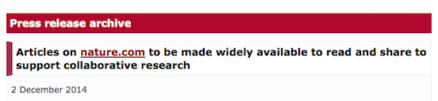
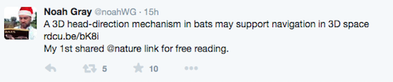
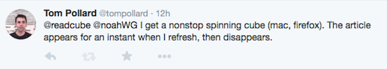
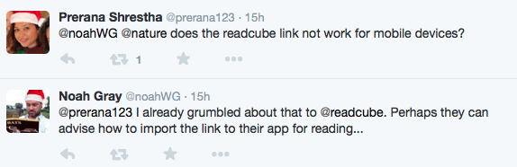
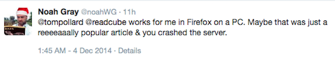

Title: More Cube Than Content
Date: 2014-12-04 11:19
Slug: nature-readcube-morecubethancontent
Author: Tom Pollard
Summary: Nature makes all articles free to view. 

<meta name="twitter:card" content="photo" />
<meta name="twitter:site" content="@tompollard" />
<meta name="twitter:title" content="More Cube Than Content" />
<meta name="twitter:description" content="Nature have announced that they will allow people to share articles via ReadCube" />
<meta name="twitter:image" content="http://tomp.io/images/2014-12-04_nature_readcube.png" />
<meta name="twitter:url" content="http://tomp.io/nature-readcube-morecubethancontent" />

Nature have [announced](http://www.nature.com/news/nature-makes-all-articles-free-to-view-1.16460) that they will be allowing people to share articles via links generated by a Macmillan-owned service called [ReadCube](http://readcube.com/) in order to *support collaborative research*.

In one way this is good: Nature are acknowledging that they have a problem with their publishing model (just like Science did when they [released Ebola content from behind their paywall](http://www.sciencemag.org/site/extra/ebola/) in response to the ongoing epidemic).

But the announcement does nothing to solve the problem (in the same way that Science's response to the Ebola epidemic disregards the fact that the journal locks up plenty of research on other nasty diseases, as [Stephen Curry](https://twitter.com/Stephen_Curry) pointed out to me yesterday). 

Nature's system is unsatisfactory because it exerts proprietary control over publicly-funded content that has value in being shared.

Last night, Noah Gray, a senior editor at Nature excitedly shared his first paper over Twitter:

<!---->

<blockquote class="twitter-tweet" lang="en">
A 3D head-direction mechanism in bats may support navigation in 3D space <a href="http://t.co/EYg621Pnwx">http://t.co/EYg621Pnwx</a>&#10;My 1st shared <a href="https://twitter.com/nature">@nature</a> link for free reading.
&mdash; Noah Gray (@noahWG) <a href="https://twitter.com/noahWG/status/540258843448844288">December 3, 2014</a></blockquote>

I clicked on the link using my laptop and waited for the article to appear, but the rotating ReadCube got *lots* more airtime than the content ([video here](http://vimeo.com/tompollard/naturereadcube)).

<!--!-->

<blockquote class="twitter-tweet" data-conversation="none" lang="en">
<a href="https://twitter.com/readcube">@readcube</a> <a href="https://twitter.com/noahWG">@noahWG</a> I get a nonstop spinning cube (mac, firefox). The article appears for an instant when I refresh, then disappears.
&mdash; Tom Pollard (@tompollard) <a href="https://twitter.com/tompollard/status/540311489601896449">December 4, 2014</a></blockquote>

[Prerana Shrestha](https://twitter.com/prerana123), meanwhile, couldn't read the article on her mobile device.

<!--!-->

<blockquote class="twitter-tweet" data-conversation="none" lang="en">
<a href="https://twitter.com/noahWG">@noahWG</a> <a href="https://twitter.com/nature">@nature</a> does the readcube link not work for mobile devices?
&mdash; Prerana Shrestha (@prerana123) <a href="https://twitter.com/prerana123/status/540261835220729856">December 3, 2014</a></blockquote>

With Nature's sharing system to succeed, we are entirely reliant on Readcube providing a robust service. ReadCube's failure to deliver on its promise, for whatever reason, means that Noah's gesture also failed.

<!--!-->

<blockquote class="twitter-tweet" data-conversation="none" lang="en">
<a href="https://twitter.com/tompollard">@tompollard</a> <a href="https://twitter.com/readcube">@readcube</a> works for me in Firefox on a PC. Maybe that was just a reeeeaaally popular article &amp; you crashed the server.
&mdash; Noah Gray (@noahWG) <a href="https://twitter.com/noahWG/status/540321000274264064">December 4, 2014</a></blockquote>

Maybe I crashed the server or maybe this is a ham-fisted attempt to control publicly-funded research content. The result is the same: the value of the content is completely negated. Even if I'd been able to access the article, Nature prevents me from printing it or adding it to my reference manager. 

This announcement isn't about supporting collaborative research, it's about controlling content through the ReadCube platform. If the content was open access, we could *all* help to deliver it to wherever it needs to be, whether that's a classroom, a clinic, or someone's phone. 

