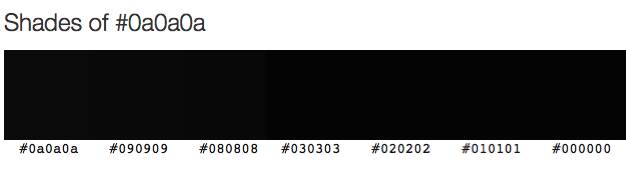

Title: There are many shades of open access and they are all black
Date: 2014-12-06 14:20
Slug: new-colour-of-open-access-0A0A0A
Author: Tom Pollard
Summary: #OAOAOA: the colour of open access

<meta name="twitter:card" content="photo" />
<meta name="twitter:site" content="@tompollard" />
<meta name="twitter:title" content="There are many shades of open access and they are all black" />
<meta name="twitter:description" content="#OAOAOA: the colour of open access" />
<meta name="twitter:image" content="http://tomp.io/images/2014-12-06_0A0A0A.png" />
<meta name="twitter:url" content="http://tomp.io/new-colour-of-open-access-0A0A0A" />

Open access has been linked to various colours, most notably [green and gold](http://www.timeshighereducation.co.uk/420454.article). These colours are responsible for one of the most confusing thoughts I've come across in a long time: [pre-green fool's-gold and post-green fair-gold](http://openaccess.eprints.org/index.php?/archives/1062-Pre-Green-Fools-Gold-and-Post-Green-Fair-Gold-OA.html). 

Green and gold terminology is not good: it reinforces belief that open access can only happen in two ways, which limits the way we think. Cameron Neylon pointed this out in the [Times Higher Education](http://www.timeshighereducation.co.uk/comment/opinion/lets-get-this-straight/2002789.article) over a year ago.

If we want to achieve open and collaborative research, we need to shed a lot of historical baggage. Not only nonsense colours, but journal impact factors as measures of quality, citations to paywalled articles when open versions exist, and the [AAAS](http://www.aaas.org/)*.

And then we need people to fill the voids. We need to work together to create a culture of open and collaborative research by changing mindsets and improving technology.

So I'm going to stick with one colour for open access - #OAOAOA - and I'd love it if you would do the same.  <!-- There are many shades of #OAOAOA and they are all black: --> Does it need to be more complicated?

**Open access means unrestricted online access to peer-reviewed scholarly research**.

*Only joking about the AAAS. Mostly. I am a little disappointed that they didn't have the courtesy to respond to [this open letter](http://www.newstatesman.com/science/2014/08/new-scientific-journal-science-advance-condemned-open-access-advocates).

