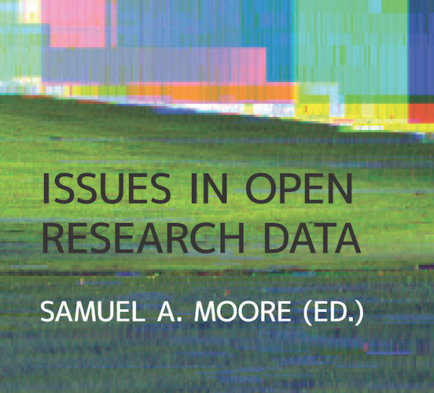

Title: Issues in Open Research Data: Health
Date: 2014-12-20 12:39
Slug: issues-in-open-research-data
Author: Tom Pollard
Summary: Culture is largely the barrier that restricts flow of research data

<meta name="twitter:card" content="photo" />
<meta name="twitter:site" content="@tompollard" />
<meta name="twitter:title" content="Issues in Open Research Data" />
<meta name="twitter:description" content="Culture is largely the barrier that restricts flow of research data" />
<meta name="twitter:image" content="http://tomp.io/images/issues_open_research_data_1.png" />
<meta name="twitter:url" content="http://tomp.io/issues-in-open-research-data" />

*The following text is reproduced from Samuel Moore's book on Issues in Open Research Data:*

As we pass through life in the digital era we leave a health trajectory in our wake. Phones, shopping habits, and visits to the doctor create a trace of data that can be used to not only assess our past and present wellbeing, but also forecast the future. To some, this is an unparalleled opportunity to improve health care, whereas to others it is an emerging threat to civil liberty. Most of us camp somewhere between the two poles: we see the rewards and we acknowledge the concerns. The question is how we move past this point, when business models and legal frameworks, built for a pre-internet world, struggle to keep up with the pace of change.

The movement to give us open access to research articles began roughly fifteen years ago. Before the dust has settled, there is now a strong push from researchers, funders, and publishers to open the data that underpins those articles. The suggestion to share research data is hardly new, but technology now exists to enable sharing with relative ease. Culture is largely the barrier that restricts flow of research data, and for data sharing to be adopted there are challenges to overcome around privacy, competition, and incentives to share.

Continued in: 

*Pollard, T. and Celi, L. A. 2014. Open Data in Health Care. In: Moore, S. A. (ed.) Issues in Open Research Data. Pp. 129–140. London: ­Ubiquity Press. DOI: [http://dx.doi.org/10.5334/ban.h](http://dx.doi.org/10.5334/ban.h)*

